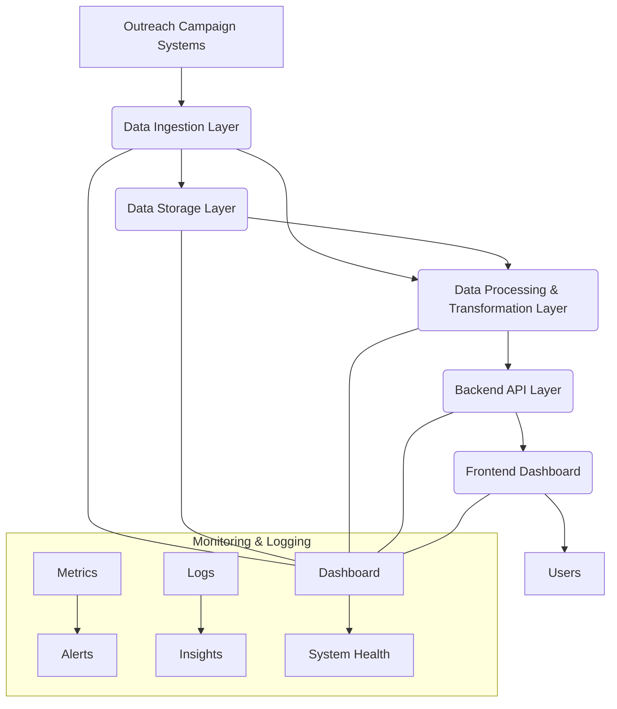

# Software Architecture Document: Member-Facing Proactive Outreach Campaign Monitoring Dashboard

## 1. Introduction

This document outlines the software architecture for the new dashboard designed to monitor member-facing proactive outreach campaigns. It defines the system's structure, components, interfaces, and key technologies, ensuring a robust, scalable, and maintainable solution.

### 1.1. Purpose
The primary purpose of this document is to provide a comprehensive architectural blueprint for the campaign monitoring dashboard. It serves as a guide for development, deployment, and future enhancements.

### 1.2. Scope
This document covers the end-to-end architecture, from data ingestion from various outreach campaign sources to the presentation layer for end-users, including considerations for security, scalability, and deployment.

### 1.3. Goals
*   Provide real-time or near real-time insights into campaign performance.
*   Offer a user-friendly and intuitive interface for campaign managers and stakeholders.
*   Ensure data accuracy, consistency, and reliability.
*   Design a scalable architecture capable of handling increasing data volumes and user loads.
*   Implement robust security measures to protect sensitive member data.
*   Ensure the system is maintainable and extensible for future enhancements.

## 2. Architectural Drivers

### 2.1. Business Requirements
*   Monitor the effectiveness of proactive outreach campaigns.
*   Track key metrics such such as engagement rates, conversion rates, and member responses.
*   Identify trends and anomalies in campaign performance.
*   Provide drill-down capabilities for detailed analysis of campaign segments.
*   Support various reporting views for different stakeholders (e.g., marketing, operations).

### 2.2. Technical Requirements
*   Integration with existing outreach campaign platforms.
*   Low data latency for critical metrics.
*   High availability and fault tolerance.
*   Secure handling of Personally Identifiable Information (PII) and Protected Health Information (PHI) if applicable.

### 2.3. Quality Attributes
*   **Performance:** Dashboard load times should be minimal (under 5 seconds for typical views); data processing must keep up with ingestion rates.
*   **Scalability:** The system must be able to scale horizontally to accommodate growth in campaigns, members, and data volume without significant performance degradation.
*   **Security:** Adherence to industry best practices for data encryption (at rest and in transit), access control (RBAC), and vulnerability management.
*   **Usability:** Intuitive user interface (UI) and user experience (UX) to facilitate data exploration and analysis.
*   **Maintainability:** Modular design, clear code structure, comprehensive documentation, and automated testing to simplify updates and troubleshooting.
*   **Reliability:** High uptime (e.g., 99.9% availability) and robust error handling to ensure data integrity and continuous service.
*   **Extensibility:** Architecture should support easy addition of new data sources, metrics, and visualization types.

## 3. High-Level Architecture

The dashboard system will follow a layered, loosely coupled architecture, leveraging cloud-native services for scalability and reliability. The core components and data flow are conceptualized as follows:

### 3.1. Key Architectural Layers
*   **Data Ingestion Layer:** Responsible for collecting raw campaign data from various sources.
*   **Data Storage Layer:** Stores both raw and processed data efficiently for analytical queries.
*   **Data Processing & Transformation Layer:** Cleans, transforms, aggregates, and enriches raw data into consumable formats for reporting.
*   **Backend API Layer:** Exposes processed data to the frontend dashboard via a secure and performant API.
*   **Frontend Dashboard Layer:** Provides the user interface for visualizing and interacting with campaign data.
*   **Monitoring & Logging:** Cross-cutting concern for observing system health and performance.

## 4. Component Deep Dive & Technology Stack

### 4.1. Data Ingestion Layer
*   **Purpose:** To reliably collect data from diverse member outreach campaign systems, supporting both real-time and batch integration patterns.
*   **Mechanisms:**
    *   **API Polling/Webhooks:** For systems exposing APIs, custom services will poll data or subscribe to webhooks.
    *   **Event Streaming:** For real-time updates and high-volume event data (e.g., member interactions).
    *   **Batch ETL Jobs:** For historical data loads or systems that export data periodically.
*   **Proposed Technology Stack:**
    *   **Event Streaming:** Apache Kafka (managed service preferred, e.g., Confluent Cloud, AWS MSK) for reliable, scalable message queuing.
    *   **Serverless Functions:** AWS Lambda/Azure Functions/Google Cloud Functions for event-driven processing of webhooks or API polling logic.
    *   **ETL Orchestration:** Apache Airflow or a managed equivalent (e.g., AWS Step Functions, Azure Data Factory, Google Cloud Composer) for scheduling and monitoring batch data ingestion jobs.

### 4.2. Data Storage Layer
*   **Purpose:** To store raw, semi-processed, and fully aggregated campaign data, optimized for analytical queries and long-term retention.
*   **Proposed Technology Stack:**
    *   **Data Lake (Raw Data):** AWS S3, Azure Blob Storage, or Google Cloud Storage. Provides cost-effective, scalable storage for immutable raw data.
    *   **Data Warehouse (Processed Data):** Snowflake, Google BigQuery, or AWS Redshift. A cloud-native, highly scalable analytical data warehouse optimized for complex SQL queries and aggregations.

### 4.3. Data Processing & Transformation Layer
*   **Purpose:** To clean, validate, transform, enrich, and aggregate raw data into a structured format suitable for consumption by the dashboard API.
*   **Mechanisms:**
    *   **Batch Processing:** For complex data transformations, aggregations, and historical data re-processing.
    *   **Stream Processing:** For real-time calculations and immediate metric updates.
*   **Proposed Technology Stack:**
    *   **Batch Processing:** Apache Spark (managed service like AWS EMR, Databricks, or Google Dataproc) for distributed data processing.
    *   **Data Transformation Tool:** dbt (data build tool) for defining, testing, and documenting SQL-based transformations within the data warehouse.
    *   **Stream Processing:** Apache Flink or Kafka Streams for real-time aggregation of event data.

### 4.4. Backend API Layer
*   **Purpose:** To serve aggregated and processed campaign data to the frontend dashboard, providing a clear, secure, and performant interface.
*   **Architecture:** Will likely adopt a microservices approach to allow independent development and scaling of different data endpoints.
*   **Proposed Technology Stack:**
    *   **Framework:** Python with Flask or FastAPI (for RESTful APIs, performance, and asynchronous capabilities).
    *   **Containerization:** Docker for packaging API services.
    *   **API Gateway:** AWS API Gateway, Azure API Management, or Google Cloud Endpoints for routing, security, caching, and rate limiting.

### 4.5. Frontend Dashboard Layer
*   **Purpose:** To present campaign performance data visually and interactively to users, allowing for data exploration and reporting.
*   **Proposed Technology Stack:**
    *   **Framework:** React.js or Angular (for building a dynamic and responsive Single Page Application).
    *   **Charting Library:** D3.js, Chart.js, or a commercial charting library like Highcharts/AG Grid for rich data visualizations.
    *   **UI Component Library:** Material-UI or Ant Design for consistent and modern UI components.

### 4.6. Security Layer
*   **Authentication & Authorization:**
    *   **Authentication:** OAuth 2.0 / OpenID Connect using an Identity Provider (IdP) like Okta, Auth0, or a cloud-native service (AWS Cognito, Azure AD, Google Identity Platform).
    *   **Authorization:** Role-Based Access Control (RBAC) implemented at the API layer, restricting data access based on user roles and permissions.
*   **Data Encryption:**
    *   **Encryption at Rest:** All data stored in the Data Lake and Data Warehouse will be encrypted using platform-managed or customer-managed keys.
    *   **Encryption in Transit:** All communication between components (internal APIs, external integrations, user to dashboard) will use TLS/SSL.
*   **Network Security:** Implement Virtual Private Clouds (VPCs), security groups, and network access control lists (NACLs) to isolate and secure network traffic.
*   **Vulnerability Management:** Regular security assessments, penetration testing, and static/dynamic application security testing (SAST/DAST).

### 4.7. Deployment & Infrastructure
*   **Cloud Provider:** Leverage a single cloud provider (e.g., AWS, Azure, or GCP) for consistency and efficiency.
*   **Container Orchestration:** Kubernetes (managed service like AWS EKS, Azure AKS, or Google GKE) for deploying, scaling, and managing containerized services.
*   **Infrastructure as Code (IaC):** Terraform or AWS CloudFormation/Azure Resource Manager/Google Cloud Deployment Manager for defining and provisioning infrastructure.
*   **CI/CD Pipeline:** GitHub Actions, GitLab CI, or Jenkins for automated build, test, and deployment of all code changes.

### 4.8. Monitoring & Logging
*   **Purpose:** To proactively identify issues, track system performance, and provide comprehensive operational insights.
*   **Proposed Technology Stack:**
    *   **Metrics & Dashboards:** Prometheus and Grafana (or cloud-native equivalents like AWS CloudWatch, Azure Monitor, Google Cloud Monitoring) for collecting and visualizing application and infrastructure metrics.
    *   **Centralized Logging:** ELK Stack (Elasticsearch, Logstash, Kibana) or Splunk for aggregating, searching, and analyzing logs from all components.
    *   **Alerting:** Integration with PagerDuty, Opsgenie, or Slack for critical alerts based on predefined thresholds.

## 5. Deployment Strategy

The dashboard will follow a continuous deployment strategy facilitated by robust CI/CD pipelines. Each component will be containerized and deployed as independent microservices within a Kubernetes cluster.

*   **Environments:** Dedicated development, staging, and production environments to ensure thorough testing before production rollout.
*   **Automated Deployments:** Changes merged into the main branch will automatically trigger builds, tests, and deployments to the staging environment. Manual approval or automated gates will control promotion to production.
*   **Blue/Green or Canary Deployments:** To minimize downtime and risk during production updates.
*   **Rollback Capability:** Automated rollback mechanisms in case of deployment failures or critical issues.

## 6. Scalability and Performance

*   **Horizontal Scaling:** All layers (Data Ingestion, Processing, API, Frontend) are designed to scale horizontally by adding more instances/pods.
*   **Stateless Services:** Backend API services will be primarily stateless, enabling easy scaling and resilience.
*   **Caching:** Implement caching at the API layer (e.g., Redis, Memcached) and potentially within the frontend to reduce database load and improve response times for frequently accessed data.
*   **Asynchronous Processing:** Long-running data processing tasks will be handled asynchronously using message queues to avoid blocking user requests.
*   **Database Optimization:** Optimized data warehouse schema design, partitioning, and indexing for fast query performance.
*   **Content Delivery Network (CDN):** Utilize a CDN for serving frontend static assets to reduce latency and improve load times globally.

## 7. Maintainability and Extensibility

*   **Modular Design:** Clearly defined boundaries and interfaces between components, allowing independent development and updates.
*   **Code Quality:** Adherence to coding standards, comprehensive unit and integration testing, and peer code reviews.
*   **Documentation:** Detailed API documentation, architectural diagrams, and runbooks for operational support.
*   **Configurability:** Externalized configuration for environment-specific settings, feature flags, and business rules.
*   **API-First Approach:** New features or integrations will be exposed via well-documented and versioned APIs.

## 8. Future Considerations

*   **Advanced Analytics:** Integration of machine learning models for predictive analytics (e.g., predicting campaign effectiveness, member churn).
*   **Self-Service Reporting:** Empowering business users to create custom reports and dashboards.
*   **Integration with CRM/Marketing Automation:** Deeper integration with enterprise CRM and marketing automation platforms for a unified view of member interactions.
*   **Anomaly Detection:** Automated alerting for unusual patterns or significant deviations in campaign performance.

